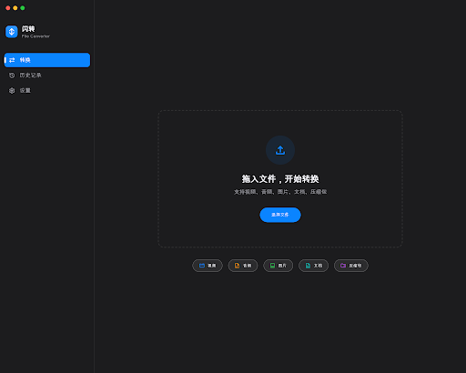
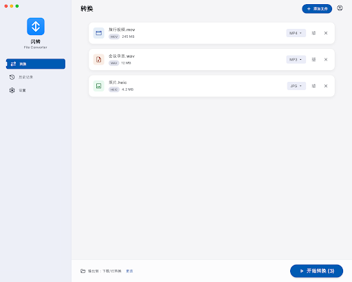
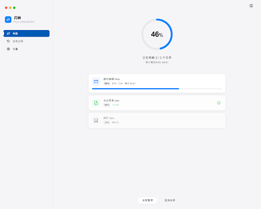
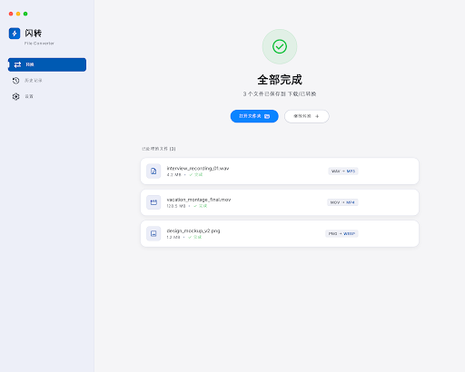
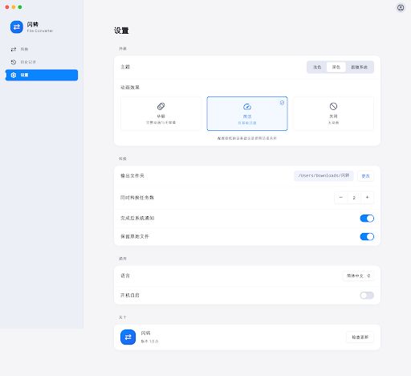

# 闪转 FlashConvert

Apple 风格的 Windows 本地文件格式转换器：把文件拖进来，选好目标格式，点开始。快、稳、好看，全程本地转换不上传。


## 功能

- **视频**：MP4 / MKV / WebM / MOV 互转，视频转 GIF（调色板高质量），提取音频；分辨率、码率、帧率、编码器（H.264/H.265/VP9/AV1）可调；**硬件加速**自动探测 NVIDIA NVENC / Intel QSV / AMD AMF，失败自动回退软件编码，设置里可一键开关
- **音频**：MP3 / WAV / FLAC / AAC / OGG / M4A 互转；码率、采样率、声道、响度标准化（-14 LUFS）
- **图片**：JPG / PNG / WebP / AVIF / GIF / TIFF 互转，支持 HEIC（libheif）与 BMP/ICO/PSD 输入；质量、尺寸、宽高比、EXIF、透明背景填充
- **文档**：Markdown / HTML / DOCX / EPUB / TXT 互转（Pandoc，首次使用自动下载）；装有 LibreOffice 时支持 Office → PDF
- **压缩包**：ZIP / 7Z / TAR 互转（支持 gz/tgz/bz2/xz 输入），压缩级别与 AES 加密密码
- 并发队列（1-4）、失败自动重试、取消不留残余、输出重名自动加序号、历史记录（再次转换/打开文件/打开位置）
- 浅色 / 深色 / 跟随系统主题；**动画三档**（华丽 / 简洁 / 关闭），低配设备可一键降档



## 安装

从 [Releases 页面](https://github.com/wyh5650-oss/flashconvert/releases) 下载：

**Windows**

- `FlashConvert-Setup-*.exe` — 安装版（NSIS，可选安装目录）
- `FlashConvert-Portable-*.exe` — 便携版，免安装直接运行

**macOS**

- `FlashConvert-*-mac-arm64.dmg` — Apple Silicon（M 系列芯片）
- `FlashConvert-*-mac-x64.dmg` — Intel 芯片
- 首次打开如提示"无法验证开发者"，到「系统设置 → 隐私与安全性」点「仍要打开」（未签名应用的标准提示）

自行构建：`npm ci && npm run dist`（Windows）/ `npm run dist:mac`（macOS）；打 `v*` 标签推送会由 GitHub Actions 自动构建双平台并附到 Release。

**装完即用**：图片/音视频/压缩包转换开箱即用（FFmpeg、libvips、7-Zip 已内置）；MD/DOCX 等文档转 PDF 用内置 Chromium 打印引擎，同样开箱即用。仅两个例外：文档格式互转首次使用时自动联网下载 Pandoc（约 40MB 一次性，**内置国内镜像自动切换**，GitHub 打不开也能下）；Office→PDF 想要更高保真可安装 [LibreOffice](https://zh-cn.libreoffice.org/)（[清华 TUNA 镜像下载](https://mirrors.tuna.tsinghua.edu.cn/libreoffice/libreoffice/stable/)），未装时自动走内置引擎。安装包未做代码签名，Windows SmartScreen 提示时点「更多信息 → 仍要运行」。

**国内开发者加速**：仓库自带 `.npmrc` 已把 Electron 与打包工具链二进制指向 npmmirror；npm 包源加速请执行 `npm config set registry https://registry.npmmirror.com`。运行时的 Pandoc 下载内置三个加速镜像（gh-proxy.com / ghproxy.net / ghfast.top）按序自动兜底。

## 开发

```bash
npm install
npm run dev        # 开发模式（热更新）
npm run typecheck  # 类型检查
npm run build      # 构建产物到 out/
npm run dist       # 打包安装程序到 dist/
npx electron . --test-convert  # 引擎自测试（真实转换全矩阵）
```

技术栈：Electron + Vite + React + TypeScript，状态 Zustand，样式 CSS Modules + 设计 token。
转换引擎全部来自开源项目（FFmpeg、sharp/libvips、7-Zip、Pandoc、libheif），详见 [THIRD_PARTY_LICENSES.md](THIRD_PARTY_LICENSES.md)。

## 关于作者


**win96** · [哔哩哔哩主页](https://space.bilibili.com/543206049)

制作不易，求赞助 qwq —— 应用内「设置 → 关于 → 赞助作者」有支付宝二维码。

## 界面预览

| | |
| --- | --- |
|  |  |
|  |  |
